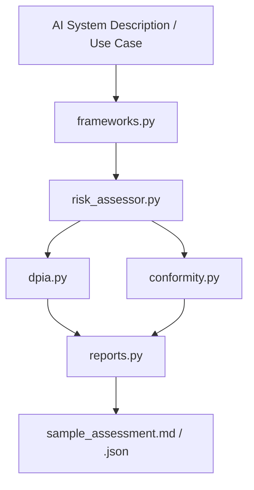

# Architecture — AIGP Governance Toolkit

This document describes the system design for Technical Account Managers, AI Governance leads, and reviewers who need to explain the solution to enterprise stakeholders.

---

## High-Level Flow

---

## Component Responsibilities

| Component | Responsibility | Primary Consumers |
|-----------|----------------|-------------------|
| `frameworks.py` | Map use-case attributes to NIST AI RMF, EU AI Act signals, ISO/IEC 42001 evidence points; maintain demo use-case catalog | Risk engine, reports, notebooks |
| `risk_assessor.py` | Quantitative + qualitative risk scoring, flags, HITL / DPIA recommendations | DPIA, conformity, TAM briefings |
| `dpia.py` | Structured Data Protection Impact Assessment draft | Privacy / legal discussion, evidence packs |
| `conformity.py` | Mock technical documentation / conformity-style checklist | High-risk system readiness discussions |
| `reports.py` | Assemble and export full JSON + Markdown assessment | Audit trails, customer reviews |
| `main.py` | CLI orchestration | Operators, portfolio demos |
| `tests/` | Unit tests for mapping, scoring, and end-to-end assembly | Engineering hygiene |

---

## Design Principles

1. **Standards-first** — Outputs are structured so they can be discussed in NIST AI RMF, EU AI Act, and ISO/IEC 42001 language.
2. **Separation of concerns** — Framework mapping, risk scoring, DPIA, conformity, and export are independent modules.
3. **Demo catalog** — Predefined use cases (LLM support agent, credit scoring, internal code assistant, agentic workflow) enable realistic offline demos.
4. **Auditability** — Every run can produce immutable JSON + Markdown artefacts suitable for risk committees.
5. **Testability** — Core logic is covered by pytest; thresholds and heuristics are explicit and tunable.

---

## Data Contracts (Simplified)

**Use-case attributes (key fields):**
- `name`, `description`, `data_categories[]`
- `automated_decision`, `affects_individuals`, `high_stakes_domain`
- `third_party_model`, `human_in_the_loop_possible`, `sector`

**Assessment result (key fields):**
- `risk` (score, level, flags, findings, HITL/DPIA recommendations)
- `nist_ai_rmf`, `eu_ai_act`, `iso_42001`
- `dpia` draft structure
- `conformity_checklist`
- `disclaimer`

---

## Extension Points for Enterprise Use

- Replace demo use cases with organisation-specific AI system inventory.
- Tune risk weights and thresholds to match internal risk appetite.
- Export evidence packs into existing GRC or document management systems.
- Combine with model-output bias/drift scripts (companion portfolio repos) for a fuller Measure/Manage loop.
- Add a lightweight questionnaire UI (Streamlit / Gradio) for TAM-led customer workshops.

---

## License

MIT — see [LICENSE](LICENSE). Suitable for open-source distribution with clear IP expectations for enterprise legal review.
