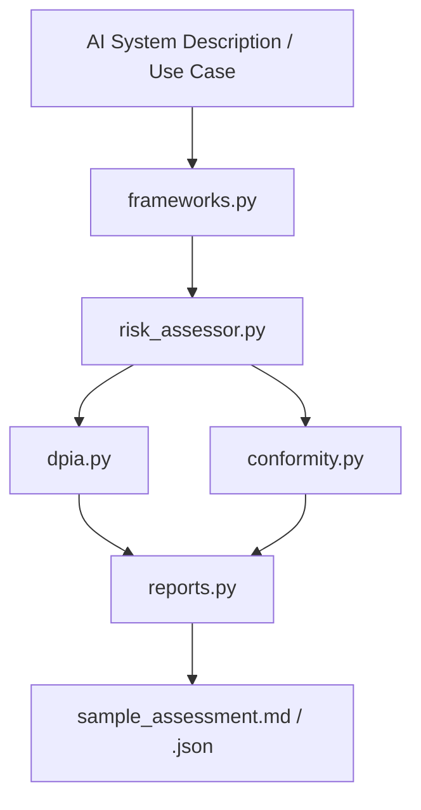

# AIGP Governance Toolkit

**Enterprise AI Risk, DPIA & Conformity Assessment Toolkit for AI Governance Professionals.**

A practical, standards-aligned Python toolkit that helps Technical Account Managers, AI Governance leads, and AIGP candidates structure risk assessments, map controls to leading frameworks, and produce audit-ready evidence packages.

Designed for portfolio demonstration of:

- NIST AI Risk Management Framework (AI RMF)
- EU AI Act risk classification & transparency obligations
- ISO/IEC 42001 AI Management System concepts
- Data Protection Impact Assessments (DPIAs)
- Mock Conformity Assessments
- Bias / drift / lineage monitoring hooks
- Human-in-the-loop (HITL) and third-party risk considerations

---

## Key Features

- **Framework Mapper** — Map system characteristics to NIST AI RMF functions (Govern, Map, Measure, Manage) and EU AI Act risk tiers.
- **DPIA Generator** — Produce structured Data Protection Impact Assessment drafts for high-risk AI use cases.
- **Conformity Assessment Skeleton** — Generate mock technical documentation checklists aligned with EU AI Act Annex requirements.
- **Risk Scoring Engine** — Quantitative + qualitative risk scoring with configurable thresholds.
- **Bias / Drift / Lineage Hooks** — Lightweight Python checks that can be extended to real model outputs.
- **Audit Report Export** — JSON + Markdown evidence packs suitable for internal review, customer briefings, or AIGP case studies.
- **Clean, Testable Code** — Modular design with unit tests demonstrating engineering discipline.

---

## Architecture



**Component flow (text):**

```
[AI System Description / Use Case]
              │
              ▼
    ┌─────────────────────┐
    │  Framework Mapper   │  ← frameworks.py
    │  (NIST / EU AI Act  │
    │   / ISO 42001)      │
    └──────────┬──────────┘
               │
               ▼
    ┌─────────────────────┐
    │  Risk & DPIA Engine │  ← risk_assessor.py + dpia.py
    │  (scoring, HITL,    │
    │   third-party risk) │
    └──────────┬──────────┘
               │
               ▼
    ┌─────────────────────┐
    │  Conformity &       │  ← conformity.py + reports.py
    │  Evidence Pack      │
    │  (JSON / Markdown)  │
    └─────────────────────┘
```

See [ARCHITECTURE.md](ARCHITECTURE.md) for a deeper system view.

---

## Business & Governance Value

Written from a Technical Account Manager / enterprise audit perspective:

- **Enterprise ROI** — Automates a significant portion of manual model intake and risk questionnaire work, accelerating deployment timelines for data science and platform teams while giving TAMs a repeatable assessment pattern.
- **Risk Mitigation** — Surfaces individual-impact, high-stakes domain, third-party model, and limited-oversight signals early; maps them to NIST AI RMF, EU AI Act, and ISO/IEC 42001 language so residual risk can be discussed clearly with legal, privacy, and business stakeholders.
- **Audit Readiness** — Produces instant, structured Markdown and JSON evidence packs (DPIA drafts, conformity-style checklists, framework mappings) suitable for internal risk committees, customer governance reviews, and AIGP-style case discussions.

---

## Quickstart

```bash
git clone https://github.com/<your-username>/aigp-governance-toolkit.git
cd aigp-governance-toolkit

python -m venv venv
source venv/bin/activate          # Windows: venv\Scripts\activate
pip install -r requirements.txt

# Run a sample end-to-end assessment
python main.py --use-case "enterprise_llm_support_agent" --output examples/sample_assessment
```

View pre-generated outputs in `examples/`.

---

## Project Structure

```
aigp-governance-toolkit/
├── README.md
├── requirements.txt
├── .gitignore
├── LICENSE
├── main.py
├── src/
│   ├── __init__.py
│   ├── frameworks.py          # NIST AI RMF / EU AI Act / ISO 42001 mapping
│   ├── risk_assessor.py       # Risk scoring & flag generation
│   ├── dpia.py                # DPIA draft generator
│   ├── conformity.py          # Conformity assessment checklist
│   └── reports.py             # JSON + Markdown exporters
├── templates/                 # Optional YAML/JSON templates for use cases
├── tests/
│   └── test_governance.py
├── examples/
│   ├── sample_assessment.json
│   └── sample_assessment.md
├── notebooks/
│   └── aigp_risk_walkthrough.ipynb
└── data/
```

---

## Example CLI

```bash
# Full assessment for a predefined use case
python main.py --use-case enterprise_llm_support_agent --output examples/my_assessment

# List available demo use cases
python main.py --list-use-cases

# Run tests
pytest tests/ -v
```

---

## Governance Framework Coverage

| Framework | Coverage in Toolkit |
|-----------|---------------------|
| **NIST AI RMF** | Govern / Map / Measure / Manage functions + risk categorization |
| **EU AI Act** | Risk tier signals, transparency, human oversight, technical documentation hooks |
| **ISO/IEC 42001** | Monitoring, evaluation, continual improvement evidence structures |
| **DPIA** | Structured impact assessment aligned with GDPR-style principles |
| **AIGP Domains** | Risk management, third-party AI, compliance readiness, cross-border considerations |

---

## Sample Output Snapshot

```json
{
  "use_case": "enterprise_llm_support_agent",
  "risk_tier": "LIMITED / HIGH (contextual)",
  "nist_functions": ["Govern", "Map", "Measure", "Manage"],
  "dpia_required": true,
  "hitl_recommended": true,
  "risk_score": 0.68,
  "key_findings": [
    "Potential impact on individuals via automated recommendations",
    "Third-party model provider introduces supply-chain risk",
    "Recommend human review gate for high-stakes decisions"
  ]
}
```

---

## Roadmap (Portfolio Extensions)

- [ ] Interactive Streamlit / Gradio risk questionnaire
- [ ] Automatic mapping of findings → NIST AI RMF “Measure” tables
- [ ] Integration with model-output bias/drift scripts (link to companion Bittensor repo)
- [ ] Multi-jurisdiction policy overlay (GDPR, EU AI Act, sector rules)
- [ ] Export to Word / PDF evidence pack for customer or audit use

---

## License

MIT License — free to use, adapt, and extend for portfolio, study, or internal tooling.

---

## Author

Built as a professional portfolio project demonstrating readiness for:

- IAPP AI Governance Professional (AIGP) certification
- Technical Account Manager / AI Governance advisory roles
- Enterprise AI risk and compliance discussions

---

*Questions or improvements? Open an issue or connect via LinkedIn.*
